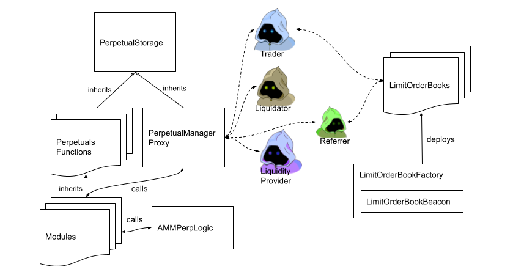
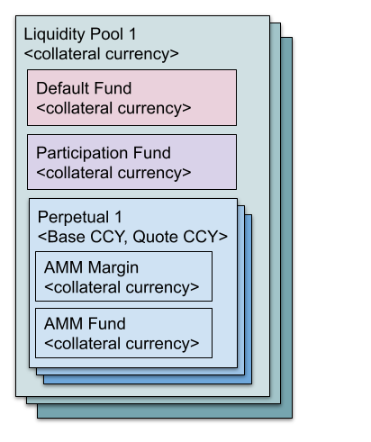
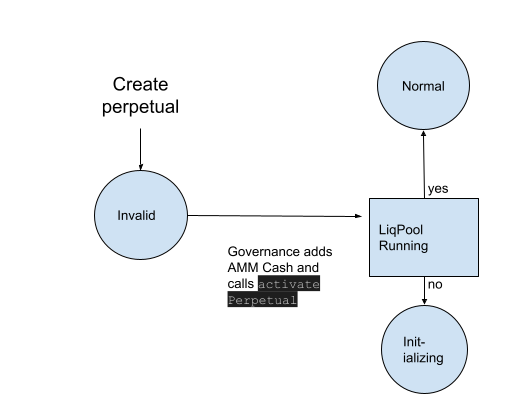
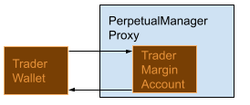

# Sovryn Perpetual Futures

With Perpetual Futures, traders can get leveraged short or long exposure to an asset. The contract is similar to that of a traditional future. Future prices move towards the spot price as the expiration nears, due to arbitrage. Perpetual Futures, however, have no expiration date and therefore they feature funding rates to pull its price towards spot. The long pays the short if the perpetual price is above the spot price. This makes the product more attractive for the short and a resulting change in demand pushes the price down towards the spot. Similar, if the price is below spot, the short pays the long to push the price upwards.

Sovryn Perpetuals are classic Perpetual Futures that rely on an automated market maker (AMM) to set prices and funding rates. The AMM adjusts prices according to market prices and demand imbalances, thereby incentivizing traders to hedge the AMM risk. Sovryn Perpetuals smart contracts allow perpetuals with different quote, base, and collateral currency (for example a BNB/USD perpetual collateralized in BTC). Different perpetuals that use the same collateral currency can share a liquidity pool. Perpetuals in the same liquidity pool share a default fund and a participation fund. The default fund is used as a liquidity cushion in case the AMM incurs losses. The participation fund allows anyone to participate in the profit and loss of the AMMs in the liquidity pool.

* Get an overview by continuing reading this document
* Read the [Whitepaper](../docs/SovrynPerpetualsV1_1.9.pdf) on Sovryn Perpetual Futures
* Have a look at the [Audit Report](../docs/Hacken_Audit_Report_5.pdf) by Hacken.io
* Repository to help you run your own [liquidator bot](https://github.com/DistributedCollective/sovryn-perpetual-swap-liquidator)
* Repository to help you run your own [order-relayer bot](https://github.com/DistributedCollective/relayer-limit-orders-for-perps)
* Create your own Typescript applications that interacts with Sovryn Perpetuals using the Sovryn Perps node package ``npm install @sovryn/perpetual-swap``


## Overview Smart Contract Design




Apart from Sovryn governance, the users of the smart contracts are traders, liquidators, liquidity providers, and order referrers.
All users interact with the *PerpetualManagerProxy*, some users interact with one or several *limit order book contracts*,
and no user interacts with any other contract directly.
Traders can perform a market order via PerpetualManagerProxy, or the can send conditional orders (stop limit or 
limit orders) to the limit order book contract corresponding to the targetet Perpetuals product (e.g. BTCUSD in
BTC pool). 

The *PerpetualStorage* contract contains all the data for all liquidity pools and perpetuals, consisting of
parameters and state variables (e.g., funds of users, funds in default fund, ...).

The *AMMPerpLogic* contract implements the math required for perpetuals that is detailed in the Whitepaper
and is called by some of the *modules* contracts.
*Modules* contracts are split into managers (PerpetualDepositManager, PerpetualLimitTradeManager, PerpetualOrderManager,...)
and logics (PerpetualRebalanceLogic, PerpetualTradeLogic, PerpetualMarginLogic, ...).

All `int128` numbers are interpreted as decimal numbers using ABDK 64x64 representation (ABDKMath64x64).

### Conditional orders
LimitOrderBookFactory deploys limit order books for each perpetual. A limit order book 
contains conditional orders (stop limit orders and limit orders). Once the AMM reaches
a price consistent with the order, an order referrer (anyone) can send the order to the Perpetual Manager Proxy
to execute the order and collect a service fee in the collateral currency.

The PerpetualManagerProxy does not know of the LimitOrderBook.
A functional discussion on stop-orders can be found here [here](../Orders.md).
We provide the [relayer-limit-orders-for-perps repository](https://github.com/DistributedCollective/relayer-limit-orders-for-perps)
as an example how to refer conditional orders.
### Liquidations
Traders of perpetual futures that do not meet their margin requirement can be liquidated by anyone (a ‘liquidator’).
Liquidators can earn a commissions by liquidating traders that are not margin safe anymore, while also protecting the AMM from running out of funds.
We published the [sovryn-perpetual-swap-liquidator repository](https://github.com/DistributedCollective/sovryn-perpetual-swap-liquidator) as an 
 example on how to check for margin safety and liquidate the unsafe traders.

## Testing

```
npm install
npx hardhat test
```
or specific tests via
```
npx hardhat test test/<nameofthetestfile.ts>
```

# Logic
The Whitepaper explains Sovryn Perpetuals from a mathematical/economical perspective. This section takes
this as given and explains on a high level how the logic described in the Whitepaper is implemented.
## Involved currencies
A perpetual future has two involved 'currencies', the **base currency** and the **quote currency**.
The base currency is the underlying that is traded, and the quote currency is the numeraire in which
the price is quoted. For example, a BTCUSD perpetual has the base currency BTC and the quote currency USD.
The convention for quotation is `<base currency><quote currency>` (BTCUSD, ETHUSD, ...).
The margin collateral, profit/loss, and funding fees are denoted in the **collateral currency** which can
differ from the base currency or quote currency.
## Hierarchy
There can be several liquidity pools.
Each liquidity pool has one default fund, one participation fund, 
and can have several Perpetuals (e.g., BTCUSD, BNBUSD, ...). 
Each perpetual has an AMM fund and like a trader it has its own margin account.
All funds within a liquidity pool are held in the same collateral currency,
and different liquidity pools can have different collateral currencies.
This data is represented in the contract `PerpStorage`.

## Funds


As detailed in the Whitepaper, the AMM has different funds:  

1. **AMM Margin**, specific to a perpetual
2. **AMM Fund, specific** to a perpetual
3. **Participation Fund**, shared within a liquidity pool
4. **Default Fund**, shared within a liquidity pool

The AMM Margin
is rebalanced on an ongoing basis to be at the initial margin level. The profit/loss is exchanged with the
different funds. The fund relevant for pricing of the perpetuals contract is the AMM Fund belonging to that perpetual. 
The participation fund allows anyone to participate in the profit and loss of the liquidity pool: participants
earn trading fees, profit from AMM gains and suffer from AMM losses. The default fund is used to accumulate funds
that can be used in case a perpetual is running out of funds to make sure traders can be paid.

* If the AMM pool funds are large compared to the risk of the AMM, the AMM is in a better position to pay the profitable traders, and so the
AMM is able to offer prices close or equal to the index price
* If the AMM pool funds are low, the AMM is at risk not being able to pay the profitable traders. As a consequence,
the AMM sets prices so that trades that help the AMM decrease the risk are cheap, trades that increase the risk are expensive.
This will incentivize traders to minimize the AMM risks, which will eventually lead to prices close to the index price.

The index price of the base/quote currency-pair is stored in `PerpStorage.settlementS2PriceData`.
The index price for base to collateral currency-pair is stored in `PerpStorage.settlementS3PriceData` 
if the base currency differs from the collateral currency ("quanto case"), otherwise this variable
remains empty.

For details of the pricing mechanism refer to the Whitepaper.
To ensure prices are neither too tight (which results in little profit for the participation fund and the AMM), nor too bad for traders, the system
perpetually rebalances between all the funds involved. This [*rebalance logic* is outlined here](../Rebalance.md).

Default Fund, and AMM Fund have target sizes that are dynamically adjusted, dependent on the risk of the AMM: 
`PerpetualUpdateFunctions: _updateDefaultFundTargetSize, _updateAMMTargetFundSize`

If the AMM fund reaches its
target size, profits are sent to default fund and participation funds. Only if the default fund reaches its target size, governance
can withdraw profits:
`PerpetualDepositManager.transferEarningsToTreasury`
<br clear="right"/>
## Perpetual States
See `PerpStorage.PerpetualState`:
* INVALID:      Uninitialized or not non-existent perpetual.
* INITIALIZING: Only when LiquidityPoolData.isRunning == false. Traders cannot perform operations.
* NORMAL:       Full functional state. Traders are able to perform all operations.
* EMERGENCY:    Perpetual is unsafe and the perpetual needs to be settled.
* CLEARED:      All margin accounts are cleared. Traders can withdraw remaining margin balance.

#### Oracle states:
- `isMarketClosed` : nobody can trade or withdraw in a perpetual that uses the oracle
- `isTerminated` : perpetual that uses the oracle is set to emergency state
### New perpetuals and liquidity pools



Once the contracts are deployed, new liquidity pools can be created via the
contract `PerpetualPoolFactory`. New perpetuals are created via `PerpetualFactory`.
A new perpetual starts in the state *invalid*. If governance adds cash to the AMM pool via
`PerpetualTreasury.addAMMLiquidityToPerpetual`, and activates the perpetual via `PerpetualFactory.activatePerpetual`,
the state is either set to *normal*, or *initializing*. State *initializing* is set if the
liquidity pool is not set to 'running' (`PerpetualPoolFactory.runLiquidityPool`).
Once the runLiquidityPool function is called, the perpetuals in state *initializing* are
set to normal and can be used. If the liquidity pool is running when a perpetual is
created, the state of the perpetual is set to `normal` directly.

Governance can also set parameters of running liquidity pools or perpetuals via the
factory contracts.
<br clear="left"/>
### Liquidity Provision
Liquidity providers can provide liquidity to the pool if the pool is running and at least one perpetual is active (PerpetualState.NORMAL).
If one or more perpetuals are in `EMERGENCY` state, liquidity providers cannot remove
the liquidity until there is no perpetual in `EMERGENCY`, that is, only once the perpetual
is in `CLEARED` state. If they could remove, (1) the calculation of remaining funds is inaccurate
if they remove during the settlement process (see next paragraph), 
and (2) liquidity providers would withdraw funds once a perpetual is in `EMERGENCY`, however 
liquidity providers are paid to take the risk of an AMM going into emergency state.

### Emergency Settlement
The contract `PerpetualSettlement` implements the logic used to shut down a perpetual in case of 
emergency. All traders are settled fairly, that is, their current profit is paid out (at the mark-price)
if sufficient funds are available. If funds are not sufficient, the loss is shared proportionally.

Reasons for emergency:
* One of the oracles used is shut down: see `PerpetualUpdateFunctions._updateOraclePricesForPool`
* Funds available in the default fund are not sufficient to cover the amount that a perpetual AMM
is requesting `PerpetualRebalanceFunctions._transferFromPoolToAMMMargin`.
* Governance can vote to shut down a perpetual `PerpetualFactory.setEmergencyState`

The contract contains two main functions: `settleNextTraderInPool` and `settle`.

* `settleNextTraderInPool`: If the perpetual state is set to EMERGENCY, governance (or anyone)
calls `settleNextTraderInPool` until every trader is processed. This will sum up
the available margin of open positions.
Once all traders are processed, `settleNextTraderInPool` calls `_setRedemptionRate`
which determines how much from the PnL the traders receive back. Usually all of it,
because the system shuts down before all funds are lost. However, in case there is not 
enough capital in the pool, the loss is shared.
The function `setRedemption` rate sets the perpetual status to cleared.
* `settle`: Once settleNextTraderInPool is finished (all Emergency-perpetuals in CLEARED state),
  traders or governance can call '`settle` to pay the trader the amount owed.

## Oracles
The pricing mechanism for Perpetual futures requires a feed of external index prices,
`S2`, the base to quote conversion (base-quote currency pair) price, and in case of a quanto perpetual
also `S3`, the collateral to quote conversion (collateral-quote currency pair). These price feeds
are connected via Oracle. Relevant contracts are as follows.
```
SpotOracle -> AbstractOracle -> (OracleInterfaceID, ISpotOracle)
OracleFactory -> OracleInterfaceID
```
where `A->(B,C)` denotes A inherits from B and C. The `OracleFactory` can create specific `SpotOracle`s that combine different price feeds
(for example to provide a BTCBNB oracle from the feeds BTCUSD and BNBUSD).

## Funding Rate
Funding payments for a trader are processed with every trade of that trader and the rate for 
all traders is refreshed on an ongoing basis (at most every block and at least with every
`updateFundingAndPricesBefore` call as part of the modifier `updateFundingAndPrices`).

The funding rate is accumulated in the variable fUnitAccumulatedFunding and 
function `PerpetualUpdateFunctions._accumulateFunding`. The variable fUnitAccumulatedFunding
perpetually accumulates funding rates for 1 unit of base currency, so that the funding rate
for a given period from t0 to t1 is given by fUnitAccumulatedFunding(t1)-fUnitAccumulatedFunding(t0)
for a position of 1. For each trader we therefore store the fUnitAccumulatedFunding value
in their margin account (`fUnitAccumulatedFundingStart` of `PerpetualStorage.MarginAccount`) and 
update the funding payment with every trade when we update the margin account, see
`PerpetualTradeLogic._updateMargin`.

The funding rate itself, prior to being accumulated and/or paid to any given trader, is computed from the Mark Price and the sign of the AMM exposure.
This is discussed in detail in Section 5 of the Whitepaper, and implemented in `_updateFundingRate(PerpetualData storage _perpetual)` in `PerpetualUpdateFunctions.sol`.

## Margin Account
Each trader has a margin account per perpetual. The trader can set the leverage and then does not explicitely have to
add margin. If the leverage amount in the order-struct is set to 0, the system assumes that the trader takes care of adding sufficient
margin themselves.

* Add margin: Traders can add margin to the margin account. `deposit(bytes32 _iPerpetualId, int128 _fAmount)`

* Remove margin: Traders can remove margin from the margin account, as much as the leverage constraints allow, all deposits if there is no 
position in this perpetual: `withdraw(bytes32 _iPerpetualId, int128 _fAmount)` or `withdrawAll(bytes32 _iPerpetualId)` to withdraw the entire
deposited margin.

## Trading
Trading always happens with the AMM as the counterparty (the AMM is setup as a trader in the system and owns its margin account). 
As a consequence, each trade can happen without matching orders.
Another consequence is that if a trader is liquidated the counterparty that is affected directly is the AMM. 

Trade notionals are determined in the base currency of the perpetual (e.g., BTC for BTCUSD, BNB for BNBUSD, ETH for ETHBTC)
and are rounded to the nearest lot size (`PerpetualStorage PerpetualData.fLotSizeBC`).

Trading is performed via two functions:
1. `PerpetualLimitTradeManager.tradeBySig(Order memory _order, bytes memory signature)`
2. `PerpetualTradeManager.trade(Order memory _order)`
the first one being used by the referrer, a person that sends the order on behalf of the trader,
the second one being used by the trader themself. Both functions require an order
of type struct defined in `IPerpetualOrder`:
```
struct Order {
        bytes32 iPerpetualId; // Identifies the perpetual the trader wants to trade
        address traderAddr;   // The ddress of the trader
        int128 fAmount;       // Signed amount in base currency to be traded
        int128 fLimitPrice;   // The limit price for stop-limit and limit orders,
                              //  specifies the worst acceptable price (slippage limit)
                              //  for market orders
        int128 fTriggerPrice; // Non-zero for stop-limit orders. Only if the mark-price reaches
                              // this price (buy: >=, sell <=), the order can be executed
        uint256 iDeadline;    // The order expires at this timestamp in seconds
        address referrerAddr; // If the order is to be executed by a referrer, this is the address
                              // of the referrer
        uint32 flags;         // see OrderFlags.sol
        int128 fLeverage;     // 0 or targeted leverage
        uint256 createdTimestamp; // timestamp for order
    }.
```
Variables of type `int128` are decimal number represented in ABDK 64x64 format. 


Traders associate a wallet address on the Perpetuals contracts' native chain with a
margin account that is maintained within the Perpetuals contracts (see `PerpStorage.sol`).
Traders can deposit margin (`function deposit(bytes32 _iPerpetualId, int128 _fAmount)` in `PerpetualDepositManager`) and 
withdraw margin (`function withdraw(bytes32 _iPerpetualId, int128 _fAmount)` in `PerpetualWithdrawManager`).
They can only withdraw if there is either no open position, or the open position is above initial margin (i.e.,
there is a profit). The margin account is per trader wallet address and perpetual.
If the trader wants to trade using a targeted leverage, they need to delegate a certain amount to
the `PerpetualManagerProxy` contract. If the order contains a non-zero leverage, the contract
will then withdraw the required amount from the trader wallet to obtain the targeted leverage.

Funding payments are paid from and paid to the trader margin account. Withdrawals to the trader
wallet occur when the user withdraws margin, when leverage is to be increased, when the position is to be closed, when
a conditional order reduces the position, or when the market order
specifies to maintain the position leverage on position reduction.
<br clear="left"/>

The flags that are part of an order are defined as follows (in `OrderFlags.sol`). 
```
MASK_CLOSE_ONLY = 0x80000000;
MASK_MARKET_ORDER = 0x40000000;
MASK_STOP_ORDER = 0x20000000;
MASK_KEEP_POS_LEVERAGE = 0x08000000;
MASK_LIMIT_ORDER = 0x04000000;
```

The flag *MASK_CLOSE_ONLY* is relevant when the trader reduces the position size and does not want the position
to take on opposite sign (for example trading from 0.5 BTC long to -0.01 BTC if the trader wanted to close).
This is taken care of in `PerpetualTradeLogic._preTrade`.
The flag *MASK_MARKET_ORDER* is set if the trade is a market order, the flag *MASK_STOP_ORDER* if it is a stop-limit order, and 
*MASK_LIMIT_ORDER* if it is a limit order.
The flag *MASK_KEEP_POS_LEVERAGE* is set for market orders and relevant when the trader reduces their position size.
If the position is reduced, the position leverage decreases (by definition of leverage) if no margin is withdrawn.
If the user however sets this flag, the reduction of the position also involves a withdrawal from the trader's margin
account into the trader's wallet, so that the leverage of the position remains (approximately) constant.
Stop and limit orders implement this feature without the flag.

The function `tradeBySig` requires a signature by the trader for it to be executed by a third party (the referrer).
The function `createSignature` in the testing code `PerpetualLimitOrderBook.ts` shows an example how the trader can sign their order.


### Market orders
Market orders are the simplest form of orders that Sovryn perpetuals offer. 
`fLimitPrice` and `fTriggerPrice` are not set (equal to zero). 
The user can choose whether to set `fLeverage` to a non-zero positive value, or leave
it at zero. If `fLeverage` is set to zero, the user has to deposit sufficient margin 
into their margin account (`function deposit(bytes32 _iPerpetualId, int128 _fAmount)` in `PerpetualDepositManager`)
before being able to trade. If `fLeverage` is set to a number larger than zero, then the
contract determines the amount of collateral needed to obtain the specified leverage and then withdraws that
amount from the trader wallet before entering the trade. If the trader does not previously delegate a sufficient
amount to the Perpetuals contract, the trade will fail.

If the price obtained by the trader is worse than the `fLimitPrice`, the trade execution will fail.
In the UI, the limit price is determined based on the slippage setting that is relative to 
the mid-price (defined as the average price for a one-lot short trade and a one lot long trade).

The trader has to set all remaining parameters: its address, the id of the perpetual they want to trade,
the flags as specified above, set a timestamp, and a deadline.

The `referrerAddr` remains empty (zero).

The perpetual id can be read via the `PerpetualGetter` contract for which we provide an example
in `scripts/status/main.ts`.

### Conditional orders
Traders that post a limit order or stop limit order pay a referral fee 
which is a fixed amount per perpetual (see `PerpetualStorage.sol` `PerpetualData.fReferralRebateCC`).
A conditional order is not sent to the `PerpetualManagerProxy` contract directly, but to the 
`LimitOrderBookContract` corresponding to the perpetual. The referrer sends the order to the
 `PerpetualManagerProxy` contract once the prices are compatible with the order instructions.
Therefore for conditional orders the `referrerAddr` is non-empty.

raders need to delegate a sufficient
amount to the `PerpetualManagerProxy` contract for the trade to be succesful once referred and ensure
their wallet contains sufficient funds. If the trade cannot be executed because of insufficient funds
or allowance, `PerpetualManagerProxy` contract cancels the order.
With every new order, the UI scans all conditional orders and asks the trader
for approval of the total amount required. 

*Limit orders*:
The variable `fTriggerPrice` remains empty and all other variables in `struct Order` have to be set.

*Stop limit orders*:
The variable `fTriggerPrice` remains empty and all other variables in `struct Order` have to be set.

## PnL Participation

People can provide liquidity to the participation fund of a liquidity pool to participate in the profit and loss of the perpetual AMMs 
within that pool.
The liquidity is added via `addLiquidity(uint256 _poolId, int128 _fTokenAmount)` in `PerpetualTreasury.sol`.
The contract subsequently mints pool-tokens with the address (`LiquidityPoolData.shareTokenAddress` in `PerpStorage.sol`
that you obtain via `getLiquidityPool(uint256 _id)` of `PerpetualGetter.sol`) and emits 
```
event LiquidityAdded(uint256 indexed poolId, address indexed user, uint256 tokenAmount, uint256 shareAmount)
```

Liquidity can be withdrawn via 
`function removeLiquidity(uint256 _poolId, int128 _fShareAmount)`.

## Pricing
The approach to pricing used by the platform is inherently risk-based, as detailed in the Whitepaper. As such, the system makes exhaustive use of probabiity concepts;
most importantly, the price offered by the AMM for a given trade is a function of the probability of default and the optimal/risk-minizing theoretical trade amount, $\kappa^*$, see Section 4.2 of the Whitepaper for definitions. 
Other quantities that make use of probabilistic concepts are the target pool sizes, for both AMM and default funds.

### Probability of default
The main pricing function, implementing equation (6) in the Whitepaper, is `calculatePerpetualPrice(AMMVariables calldata _ammVars, MarketVariables calldata _mktVars, int128 _fTradeAmount, int128fMinimalSpread)` in `AMMPerpLogic.sol`. 

The risk-minimizing trade amount $\kappa^*$, discussed in Section 4.3 of the Whitepaper, is computed within the aforementioned function, but the default probability is computed separately by means of the function `calculateRiskNeutralPD(AMMVariables memory _ammVars MarketVariables calldata _mktVars, int128 _fTradeAmount, bool _withCDF)`, also contained in the contract `AMMPerpLogic.sol`.

The aforementioned default probability depends on the type of collateral used; see subsection *AMM default probability* in Section 4.2 of the Whitepaper for details and definitions. Consequently, the implementation considers two different cases, 'Quanto' and 'No-Quanto', which in turn are characterized by different ways of computing the mean and standard deviation that parametrize the underlying probability distribution, c.f. equations (13) through (18) in the Whitepaper.

More precisely, within `calculateRiskNeutralPD`, the probability of default is first parametrized by the so-called distance to default, which is the argument passed to the standard normal cummulative distribution function (CDF), up to sign transformations. This reduction essentially corresponds to equations (13), (14) and (15) in the Whitepaper, where the calculation is seen to depend on a specific set of transformations of the state variables of the AMM. Note that the CDF of the standard normal distribution is made available through `_normalCDF(int128 _fX)` in `AMMPerpLogic.sol`.

Depending on the case, the distance to default is then computed by means of one of the two functions below: 
* `_calculateRiskNeutralDDNoQuanto(MarketVariables memory _mktVars, int128 _fSign, int128 _fThresh)`, which implements equation (16), or 
* `_calculateRiskNeutralDDWithQuanto(AMMVariables memory _ammVars, MarketVariables memory _mktVars, int128 _fSign, int128 _fThresh)`, which implements equation (17).
   
The second case above relies additionally on `_calculateStandardDeviationQuanto(MarketVariables memory _mktVars, int128 _fC3, int128 _fC3_2)`, which implements equation (18). All of these functions are contained in `AMMPerpLogic.sol`.

### Capital Sizing

The target size for the default fund, as defined in Section 6.1 of the Whitepaper, is computed in `calculateDefaultFundSize(int128[2] memory _fK2AMM, int128 _fk2Trader, int128 _fCoverN, int128[2] calldata fStressRet2, int128[2] calldata fStressRet3, int128[2] calldata fIndexPrices, AMMPerpLogic.CollateralCurrency _eCCY)`, which can be found in `AMMPerpLogic.sol`. This function directly implements the logic of equations (31) through (35).

The target size for the AMM liquidity pool, discussed in detail in Section 6.2 of the Whitepaper, depends on the type of collateral currency used by the AMM. Consequently, the exact calculation is performed by one of three different functions, depending on the case at hand. These functions can be found in `AMMPerpLogic.sol`:
* `getTargetCollateralM1(int128 _fK2, int128 _fL1, MarketVariables calldata _mktVars, int128 _fTargetDD)` implements equations (36) ad (37)
* `getTargetCollateralM2(int128 _fK2, int128 _fL1, MarketVariables calldata _mktVars, int128 _fTargetDD)` implements equations (38) and (39)
* `getTargetCollateralM3(int128 _fK2, int128 _fL1, MarketVariables calldata _mktVars, int128 _fTargetDD)` implements equations (40) and (41)

## Governance
Governance can execute some functions to manage the perpetuals. Those are
restricted via a modifier. Examples are as follows.
`PerpetualDepositManager.sol` 
* `depositToDefaultFund(uint256 _poolId, int128 _fAmount)`
* `withdrawFromDefaultFund(uint256 _poolId, address _receiver,int128 _fAmount) external;` - Only allowed if pool not running.
* `transferEarningsToTreasury(uint256 _poolId, int128 _fAmount) external;`

## Gas Station Network
All the contracts are meta transactions compatible. Meaning any call to msg.sender or msg.data is done through some kind of function that split extra data appended in case the call is done through GSN or another meta transaction system on behalf of another address.

We also provide a way to pay for gas fees with our BTC ERC20 representation thanks to a so called paymaster that converts the gas cost of the network into BTC. The user then sends this amount of BTC to the paymaster which pays for the gas cost in the native currency of the network.

The paymaster is natively allowed to spend users BTC to improve UX. This avoids the approve step and thus, the need for having any amount of the native currency of the network. This allowance can be revoked permanently at any time on the ERC20 BTC representation smart contract.

You will find everything related to thing under the contracts/gsn folder.

# Using the (perp|wallet)Utils functions from the [npm package](https://www.npmjs.com/package/@sovryn/perpetual-swap)

The utility functions from this repository are published as an [npm package](https://www.npmjs.com/package/@sovryn/perpetual-swap), so whenever something gets changed in the `scripts/utils/` folder, the consumers of these functions ([the liquidator](https://github.com/DistributedCollective/sovryn-perpetual-swap-liquidator), [the dApp](https://compete.sovryn.app/perpetuals/), etc) can have the functionality updated easily.

## Usage of the npm package

Install the package
```
$ npm install --save @sovryn/perpetual-swap
```

Then in your script: 
`import { walletUtils, perpQueries, perpUtils } from "@sovryn/perpetual-swap";`

And to use the functions from, let's say, `scripts/utils/perpQueries.ts`:
`const { queryTraderState, queryAMMState, queryPerpParameters } = perpQueries;`

The same works for the rest of the files:
`const { getMarkPrice } = perpUtils;`

* See [here the docs for the functions exported by `perpUtils`](../scripts/utils/perpUtils.md).
* See [here the docs for the functions exported by `perpQueries`](../scripts/utils/perpQueries.md).
* See [here the docs for the functions exported by `perpMath`](../scripts/utils/perpMath.md).
* See [here the docs for the functions exported by `walletUtils`](../scripts/utils/walletUtils.md).


